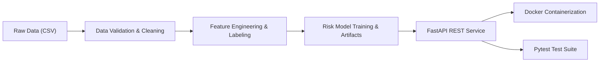

# Distributor Credit Risk Service — Implementation Roadmap & Guide

This document outlines the step-by-step methodology to build, train, serve, and deploy the **Distributor Credit Risk Scoring Service** based on the assignment brief in [Assignment_Candidate_Brief_HighLevel.docx](file:///Users/sahirskd/Desktop/Projects/Learning/Candidate_Take-Home_Assignment/docs/Assignment_Candidate_Brief_HighLevel.docx).

---

## High-Level Architecture & Workflow



---

## Phase 1: Exploratory Data Analysis (EDA) & Data Integrity Checks

*Conducted in `notebook/data-understanding.ipynb` before writing production code.*

### 1. Key Integrity Validations
- **Referential Integrity**: Verify if every `distributor_id` in `orders.csv` and `payments.csv` exists in `distributors.csv`. Detect and log orphaned records.
- **Date Chronology**: Verify chronological sequence:
  $$\text{onboarded\_date} \le \text{order\_date} \le \text{invoice\_date} \le \text{due\_date} \le \text{payment\_date}$$
  Detect impossible dates, inverted intervals, or future dates.
- **Financial Reconciliation**:
  - Detect negative invoice/order amounts.
  - Detect payments exceeding invoice totals (`amount_paid_inr > invoice_amount_inr`).
  - Detect inconsistencies (e.g., `payment_status == 'paid'` but `amount_paid_inr < invoice_amount_inr` or missing `payment_date`).
- **Missing Value Patterns**:
  - Missing `payment_date` for `overdue` vs `paid` records.

---

## Phase 2: Target Label Definition & Feature Engineering

### 1. Defining the `high_risk` Target Label ($y \in \{0, 1\}$)
The assignment requires defining and justifying what `high_risk` means in trade credit:
- **Severe Delinquency (Default Candidate)**: A distributor with invoices $\ge 60$ or $90$ Days Past Due (DPD) with unpaid balances.
- **Default Severity Ratio**: Ratio of overdue/unpaid invoice amounts to total invoiced amounts exceeding a safety threshold (e.g., $> 20\%$).
- **Chronic Delinquency**: Average payment delay $> 30$ days past `due_date` across multiple payment cycles.

### 2. Feature Engineering (Aggregated per Distributor)

| Category | Feature Name | Description |
| :--- | :--- | :--- |
| **Exposure & Utilization** | `current_outstanding_inr` | Total unpaid invoice amount |
| | `credit_limit_utilization` | $\frac{\text{current\_outstanding}}{\text{credit\_limit\_inr}}$ |
| | `max_credit_utilization` | Peak utilization ratio historically |
| **Payment Behavior** | `avg_delay_days` | Mean of $(\text{payment\_date} - \text{due\_date})$ for paid invoices |
| | `max_delay_days` | Worst historical delay in days |
| | `on_time_payment_rate` | $\frac{\text{count}(\text{paid on or before due date})}{\text{total invoices}}$ |
| | `overdue_invoice_ratio` | $\frac{\text{count}(\text{overdue invoices})}{\text{total invoices}}$ |
| **Order Activity** | `total_orders_count` | Lifetime order volume |
| | `total_order_value_inr` | Lifetime gross order value |
| | `avg_order_value_inr` | Average order size |
| | `order_cancellation_rate` | $\frac{\text{count}(\text{cancelled})}{\text{total orders}}$ |
| | `days_since_last_order` | Recency metric |
| **Firmographics** | `tenure_days` | Days since `onboarded_date` |
| | `channel` | Distributor segment (e.g., general trade, modern trade, institution) |
| | `region` / `city` | Geographic exposure |
| | `credit_terms_days` | Agreed credit period |

---

## Phase 3: Model Training, Evaluation & Tradeoff Analysis

### 1. Algorithm Selection
- Primary models: **LightGBM / XGBoost** or **Regularized Logistic Regression / Random Forest**.
- Justification:
  - *LightGBM/XGBoost*: Handles non-linear feature interactions, mixed numerical/categorical features, and imbalanced target distributions well.
  - *Logistic Regression / Explainable Trees*: Provides clear, linear coefficient/feature importance transparency.

### 2. Evaluation Strategy
- Use stratified split to maintain class balance.
- Measure:
  - **ROC-AUC & PR-AUC (Average Precision)**: Primary metric for imbalanced classification.
  - **F1-Score, Precision, Recall**: At specific decision thresholds.
  - **Brier Score & Calibration**: Ensure risk probabilities (0.0 to 1.0) reflect empirical default frequencies.

### 3. Cost Tradeoff Analysis (False Negatives vs False Positives)
- **False Negative (FN)**: Approving credit for a distributor who defaults.
  - *Cost*: Loss of principal invoice amount + collection/legal costs (High monetary loss).
- **False Positive (FP)**: Denying credit or flagging a good distributor as high risk.
  - *Cost*: Lost sales margin and distributor relationship friction (Opportunity cost).
- **Threshold Selection Strategy**: Because $Cost(FN) \gg Cost(FP)$, adjust classification decision threshold below $0.5$ (e.g., $0.30 - 0.40$) to maximize Recall for default detection while maintaining acceptable Precision.

### 4. Model Persistence & Metadata
- Save artifacts in `model_artifacts/`:
  - `model.joblib` (Trained pipeline including encoders/scalers)
  - `metadata.json` (Training timestamp, dataset version, features used, hyperparameters, and held-out validation metrics)

---

## Phase 4: Production REST API (FastAPI)

### 1. API Endpoints
- `GET /health`
  - Healthcheck returning system status and model loading state.
- `POST /assess` or `GET /distributors/{id}/risk`
  - Input: Distributor ID or real-time feature payload.
  - Output: Risk score ($[0.0, 1.0]$), risk category (`LOW`, `MEDIUM`, `HIGH`), approval recommendation (`APPROVE`, `REVIEW`, `REJECT`), and key risk driver indicators.
- `GET /portfolio/summary`
  - Aggregate risk metrics across all distributors (portfolio risk distribution, total exposure at risk, average credit utilization).
- `POST /feedback`
  - Record realized repayment outcomes to create a feedback loop for future model monitoring and retraining.

### 2. Edge Case Handling & Status Codes
- **Unknown Distributor**: Return `404 Not Found` with structured JSON error.
- **Cold-Start (New Distributor with 0 History)**: Handle gracefully with baseline demographic scoring / rule-based fallback, documenting the policy.
- **Malformed / Missing Input**: Return `422 Unprocessable Entity`.
- **Model Missing / Service Unavailable**: Return `503 Service Unavailable`.
- Avoid raw stack traces in responses; use standard error response schemas.

---

## Phase 5: Automated Testing (Pytest)

Create comprehensive tests under `tests/`:
- **`test_pipeline.py`**:
  - Pipeline logs anomalies (e.g., corrupted rows, invalid dates) without throwing unhandled exceptions.
  - Correct aggregation of feature matrices from raw CSVs.
- **`test_model.py`**:
  - Model artifact loads successfully.
  - Inference returns calibrated probability scores strictly bounded in $[0.0, 1.0]$.
- **`test_api.py`**:
  - `/health` returns `200 OK`.
  - `/assess` returns expected schema for valid distributor.
  - Unknown distributor returns `404`.
  - Malformed payload returns `422`.
  - `/portfolio/summary` returns valid non-empty summary statistics.

---

## Phase 6: Docker Containerization

1. **`Dockerfile`**:
   - Lightweight base image: `python:3.11-slim`
   - Copy dependencies and install with `pip install --no-cache-dir -r requirements.txt`.
   - Copy application code, data, and trained model artifacts.
   - Expose port `8000`.
   - Command: `uvicorn src.api:app --host 0.0.0.0 --port 8000`.
2. **`docker-compose.yml`**:
   - Provide clean single-command deployment: `docker compose up --build`.

---

## Phase 7: Comprehensive Documentation (`README.md`)

Ensure [README.md](file:///Users/sahirskd/Desktop/Projects/Learning/Candidate_Take-Home_Assignment/README.md) covers all 6 required brief sections:
1. **Build & Run Instructions**: Exact commands for local installation, Docker deployment, and running tests.
2. **Label Definition & Justification**: Precise criteria for `high_risk` and economic justification.
3. **Algorithm Choice & Tradeoffs**: Comparative justification for the chosen ML model.
4. **FN vs FP Tradeoff Analysis**: Expected cost formulation and threshold optimization rationale.
5. **Assumptions & Edge Case Handling**: Explicit documentation of all data handling decisions.
6. **Future Improvements**: Roadmap for scalability (e.g., streaming feature stores, SHAP explainability, automated model retraining pipelines).

---

## Recommended Project File Structure

```text
.
├── Dockerfile
├── docker-compose.yml
├── README.md
├── requirements.txt
├── pyproject.toml
├── data/
│   ├── assignment_distributors.csv
│   ├── assignment_orders.csv
│   └── assignment_payments.csv
├── docs/
│   ├── Assignment_Candidate_Brief_HighLevel.docx
│   └── project_roadmap_and_guide.md
├── model_artifacts/
│   ├── model.joblib
│   └── metadata.json
├── notebook/
│   └── data-understanding.ipynb
├── src/
│   ├── __init__.py
│   ├── config.py
│   ├── pipeline.py       # Data validation, cleaning & feature extraction
│   ├── train.py          # Training and model evaluation script
│   ├── model.py          # Inference wrapper & scoring logic
│   └── api.py            # FastAPI endpoints and error handling
└── tests/
    ├── __init__.py
    ├── test_api.py
    ├── test_model.py
    └── test_pipeline.py
```
